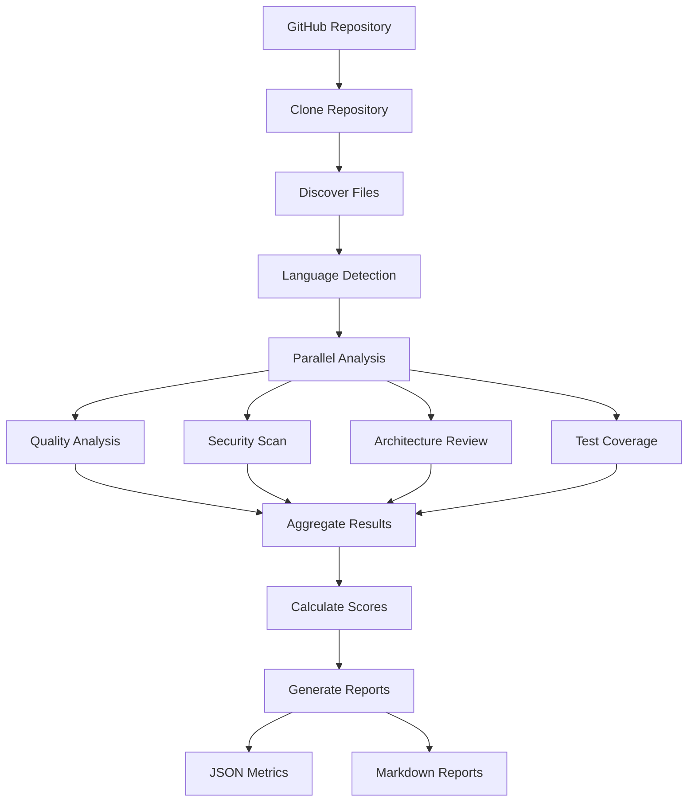

# Repo360 - Engineering Intelligence Layer


## 🎯 Overview

**Repo360** is an enterprise-grade engineering intelligence layer that provides comprehensive analysis of GitHub repositories. It goes beyond traditional static analysis to detect code quality issues, security vulnerabilities, architectural problems, and technical debt using AI-powered insights.

### The Problem

AI coding assistants accelerate development but introduce new challenges:
- ❌ Inconsistent code structure and architecture
- ❌ Poor readability & maintainability
- ❌ Duplicate or unnecessary code
- ❌ Inconsistent design patterns
- ❌ Insufficient test coverage
- ❌ Increased technical debt
- ❌ Security & dependency risks
- ❌ Harder debugging & root-cause analysis
- ❌ Non-compliance with org standards

### The Solution

Repo360 provides comprehensive analysis across multiple dimensions:
- ✅ **Code Quality**: Structure, readability, maintainability, complexity
- ✅ **Security**: Vulnerabilities, secrets, dependency risks
- ✅ **Architecture**: Design patterns, dependencies, SOLID principles
- ✅ **Testing**: Coverage, quality, critical path analysis
- ✅ **Technical Debt**: Quantification, hotspots, remediation plans
- ✅ **AI Detection**: Identifies AI-generated vs human-written code

## 🚀 Quick Start

### Installation

1. **Install Kiro** (if not already installed):
```bash
curl -fsSL https://kiro.dev/install.sh | sh
```

2. **Install Repo360 Power**:
```bash
kiro power install repo360
```

### Basic Usage

Analyze any GitHub repository:

```bash
# Analyze main branch
kiro> Analyze https://github.com/username/repository

# Analyze specific branch
kiro> Analyze https://github.com/username/repository branch:develop

# Security-focused scan
kiro> Run security scan on https://github.com/username/repository

# Quick health check
kiro> Quick health check for https://github.com/username/repository
```

### View Results

After analysis, check the `repo360-output/` directory:

```
repo360-output/
├── metrics-summary.json          # Start here - overall summary
├── quality-metrics.json          # Code quality details
├── security-metrics.json         # Security findings
├── architecture-metrics.json     # Architecture analysis
├── test-metrics.json            # Test coverage
├── technical-debt.json          # Debt quantification
└── reports/
    ├── executive-summary.md     # Human-readable overview
    ├── detailed-findings.md     # Complete analysis
    └── recommendations.md       # Actionable next steps
```

## 📊 What You Get

### Comprehensive Metrics

#### 1. Quality Metrics
- Code complexity (cyclomatic, cognitive)
- Maintainability index
- Code duplication percentage
- Code smells and anti-patterns
- Best practices compliance
- AI-generated code detection

#### 2. Security Metrics
- Vulnerability detection (OWASP Top 10)
- Dependency security (CVE scanning)
- Secret detection (API keys, passwords)
- Cryptography issues
- Authentication/authorization flaws
- Compliance mapping (PCI-DSS, GDPR, SOC2)

#### 3. Architecture Metrics
- Design pattern usage
- Dependency analysis
- Circular dependency detection
- SOLID principles compliance
- Layer violations
- Coupling and cohesion metrics

#### 4. Test Metrics
- Line, branch, function coverage
- Test distribution (unit/integration/e2e)
- Uncovered critical paths
- Test quality assessment

#### 5. Technical Debt
- Debt quantification (hours and cost)
- Hotspot identification
- Priority recommendations
- Effort estimates

## 🎯 Language Support

### Primary (Full Support)
- ☕ **Java**: Spring Boot, Jakarta EE, Maven/Gradle
- 🐍 **Python**: Django, Flask, FastAPI
- ⚛️ **React/TypeScript**: Next.js, React apps
- 📜 **JavaScript/Node.js**: Express, NestJS

### Additional Support
- Go, C#, Ruby, PHP, Rust, Kotlin, Swift

## 🏗️ Architecture

### Power Structure

```
repo360-power/
├── POWER.md                      # Power documentation
├── power.json                    # Power configuration
├── README.md                     # This file
├── agents/                       # Specialized agents
│   ├── repo360-analyzer.md       # Main orchestrator
│   ├── repo360-quality-checker.md
│   ├── repo360-security-scanner.md
│   └── repo360-architect.md
├── skills/                       # Reusable capabilities
│   ├── clone-repository.md
│   ├── analyze-java-code.md
│   ├── analyze-python-code.md
│   ├── analyze-react-code.md
│   ├── detect-security-issues.md
│   ├── analyze-architecture.md
│   ├── measure-test-coverage.md
│   ├── calculate-technical-debt.md
│   └── generate-metrics-report.md
└── steering/                     # Workflow guides
    ├── getting-started.md
    ├── enterprise-setup.md
    └── custom-rules.md
```

### How It Works



## 📈 Example Output

### Metrics Summary
```json
{
  "repository": {
    "url": "https://github.com/example/api-service",
    "branch": "main",
    "commit": "abc123..."
  },
  "scores": {
    "overall": 78,
    "quality": 82,
    "security": 68,
    "architecture": 75,
    "maintainability": 80,
    "test_coverage": 72
  },
  "issue_summary": {
    "critical": 2,
    "high": 8,
    "medium": 23,
    "low": 45
  }
}
```

### Executive Summary
```markdown
# Repository Health Report

**Overall Score**: 78/100 (Good)

## Critical Issues (2)
1. SQL Injection in UserDao.java:42
2. Hardcoded AWS credentials in Config.java:15

## Top Recommendations
1. Fix critical security vulnerabilities (4 hours)
2. Refactor high-complexity PaymentProcessor (8 hours)
3. Increase test coverage on payment logic (6 hours)

**Estimated Debt**: 234 hours ($23,400)
```

## 🛠️ Advanced Usage

### Custom Configuration

Create `.repo360/config.yml` in your repository:

```yaml
quality:
  max_complexity: 10
  max_function_length: 50
  min_maintainability: 70

security:
  fail_on_critical: true
  allowed_licenses:
    - MIT
    - Apache-2.0

testing:
  min_line_coverage: 80
  min_branch_coverage: 70
```

See [Custom Rules Guide](steering/custom-rules.md) for complete configuration options.

### CI/CD Integration

#### GitHub Actions
```yaml
- name: Run Repo360
  run: |
    kiro power install repo360
    kiro analyze-repo . --output json
    
- name: Check Quality Gate
  run: |
    score=$(jq .overall_score repo360-output/metrics-summary.json)
    if [ $score -lt 70 ]; then exit 1; fi
```

See [Enterprise Setup Guide](steering/enterprise-setup.md) for complete CI/CD examples.

### Team Workflows

**Pre-commit checks**:
```bash
kiro> Analyze changed files in current branch
```

**Pull request reviews**:
```bash
kiro> Compare code quality between main and feature/new-api
```

**Scheduled audits**:
```bash
kiro> Full repository scan with historical tracking
```

## 📚 Documentation

- **[Getting Started](steering/getting-started.md)**: Quick start guide and basic usage
- **[Enterprise Setup](steering/enterprise-setup.md)**: CI/CD integration, team workflows, compliance
- **[Custom Rules](steering/custom-rules.md)**: Customize analysis for your organization
- **[POWER.md](POWER.md)**: Complete power documentation

## 🎯 Use Cases

### Individual Developers
- Understand code quality before review
- Identify security issues early
- Learn best practices from recommendations

### Development Teams
- Maintain code quality standards
- Track technical debt
- Ensure consistent architecture

### Engineering Managers
- Monitor repository health
- Track improvement trends
- Prioritize refactoring efforts

### Security Teams
- Identify vulnerabilities
- Scan dependencies
- Ensure compliance

### Architects
- Review system design
- Ensure pattern consistency
- Identify architectural issues

## 🔒 Security & Privacy

- **No data leaves your machine**: All analysis runs locally
- **No credentials stored**: Git credentials used only for cloning
- **Sensitive data protected**: Secrets detected but never logged
- **Open source analyzers**: Uses well-known, trusted tools

## 🤝 Contributing

We welcome contributions! Areas to contribute:

- **New language support**: Add analyzers for more languages
- **Additional metrics**: Propose new quality/security checks
- **Framework patterns**: Add framework-specific analysis
- **Documentation**: Improve guides and examples
- **Bug reports**: Report issues or false positives

## 📝 License

MIT License - see LICENSE file for details

## 🙏 Acknowledgments

Built on top of excellent open-source tools:
- **Static Analysis**: Checkstyle, PMD, Pylint, ESLint
- **Security**: Bandit, SpotBugs, npm audit
- **Complexity**: Radon, Lizard
- **Coverage**: JaCoCo, Coverage.py, Istanbul

## 🆘 Support

- **Documentation**: Check steering guides
- **Issues**: Report bugs or request features
- **Discussions**: Share experiences and best practices
- **Enterprise Support**: Contact for enterprise licensing

## 🗺️ Roadmap

### v1.1
- [ ] Historical trend tracking
- [ ] Team collaboration features
- [ ] Custom rule builder UI
- [ ] More language support (Rust, Go, Kotlin)

### v1.2
- [ ] Real-time analysis in IDE
- [ ] AI-powered fix suggestions
- [ ] Automated refactoring
- [ ] Integration with issue trackers

### v2.0
- [ ] Machine learning for pattern detection
- [ ] Repository comparison
- [ ] Organization-wide dashboards
- [ ] Predictive maintenance alerts

---

**Built with ❤️ for the developer community**

*Helping teams build better software, faster.*
